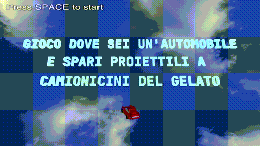
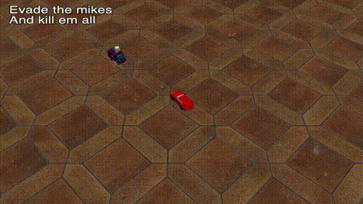

# computer-graphics-project-2024
Project for the computer graphics course at polimi, made by Alessio Spineto and Andrea Torti.
## Gioco dove sei un'automobile e spari proiettili a camioncini del gelato
The project consists in a simple videogame made from scratch using vulkan.
The game itself consist in a simple top-view shooter game with the restriction of being able to move like a car.
### Start menu

### First moments in the game

### Later stages of the game

---
Additional libraries needed, other than the included ones:
- `glfw`
- `vulkan`
- `glm` (header only)

